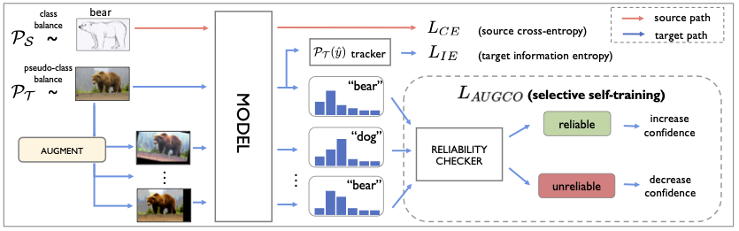

## PyTorch Code for Selective Self-training by Probing Predictive Consistency for Unsupervised Domain Adaptation
### Viraj Prabhu, Shivam Khare, Deeksha Kartik, Judy Hoffman

Many existing approaches for unsupervised domain adaptation (UDA) focus on adapting under only data distribution shift and offer limited success under additional cross-domain label distribution shift. Recent work based on self-training using target pseudolabels has shown promise, but on challenging shifts pseudolabels may be highly unreliable and using them for self-training may cause error accumulation and domain misalignment. We propose Augmentation Consistency guided Self-training (AUGCO), a UDA algorithm that probes the reliability of a target instance based on its predictive consistency under random image transformations. Our algorithm then selectively increases model confidence on consistent target instances, while reducing it on inconsistent ones. AUGCO achieves significant improvements over the state-of-the-art on 27/31 domain shifts for classification adaptation. Further, AUGCO is directly extensible to other practical settings -- to source-free UDA, wherein source data is no longer available due to memory or compute restrictions, and to adapting semantic segmentation models, achieving strong performance in each. 



Table of Contents
=================

   * [Setup and Dependencies](#setup-and-dependencies)
   * [Usage](#usage)
      * [Train and adapt model](#train-and-adapt-model)
      * [Download data](#data-download)
      * [Pretrained checkpoints](#pretrained-checkpoints)
   * [Reference](#reference)
   * [License](#license)

## Setup and Dependencies

1. Create an anaconda environment with Python 3.6: ```conda create -n sentry python=3.6.8```
                                  and activate: ```conda activate sentry```
2. Navigate to the code directory: ```cd code/```
3. Install dependencies: ```pip install -r requirements.txt```

And you're all set up! 

## Usage 

### Download data

Data for SVHN->MNIST is downloaded automatically via PyTorch. Data for other benchmarks can be downloaded from the following links. The splits used for our experiments are already included in the `data/` folder):
1. [DomainNet](http://ai.bu.edu/M3SDA/) 
2. [OfficeHome](http://hemanthdv.org/OfficeHome-Dataset/)
3. [VisDA2017](https://github.com/VisionLearningGroup/taskcv-2017-public/tree/master/classification) (only train and validation needed)

### Pretrained checkpoints

To reproduce numbers reported in the paper, we include a a few pretrained checkpoints. We include checkpoints (source and adapted) for SVHN to MNIST (DIGITS) in the `checkpoints` directory. Source and adapted checkpoints for Clipart to Sketch adaptation (from DomainNet) and Real_World to Product adaptation (from OfficeHome RS-UT) can be downloaded from [this link](https://drive.google.com/drive/folders/197MNMSx1oWPlOI3jR_oAY-tZQJtmx27T?usp=sharing), and should be saved to the `checkpoints/source` and `checkpoints/SENTRY` directory as appropriate.

### Train and adapt model

* Natural label distribution shift: Adapt a model from <source> to <target> for a given <benchmark> (where benchmark may be DomainNet, OfficeHome, VisDA, or DIGITS), as follows:

```
python train.py --id <experiment_id> \
                --source <source> \
                --target <target> \
                --img_dir <image_directory> \
                --LDS_type <LDS_type> \
                --load_from_cfg True \
                --cfg_file 'config/<benchmark>/<cfg_file>.yml' \
                --use_cuda True
```

SENTRY hyperparameters are provided via a `sentry.yml` config file in the corresponding `config/<benchmark>` folder (On DIGITS, we also provide a config for baseline adaptation via DANN). The list of valid source/target domains per-benchmark are:
   * DomainNet: real, clipart, sketch, painting
   * OfficeHome_RS_UT: Real_World, Clipart, Product
   * OfficeHome: Real_World, Clipart, Product, Art
   * VisDA2017: visda_train, visda_test
   * DIGITS: Only svhn (source) to mnist (target) adaptation is currently supported.

Pass in the path to the parent folder containing dataset images via the `--img_dir <name_of_directory>` flag (eg. `--img_dir '~/data/DomainNet'`). Pass in the label distribution shift type via the `--LDS_type` flag: For DomainNet, OfficeHome (standard), and VisDA2017, pass in `--LDS_type 'natural'` (default). For OfficeHome RS-UT, pass in `--LDS_type 'RS_UT'`. For DIGITS, pass in `--LDS_type` as one of `IF1`, `IF20`, `IF50`, or `IF100`, to load a _manually_ long-tailed target training split with a given imbalance factor (IF), as described in Table 4 of the paper. 

To load a pretrained DA checkpoint instead of training your own, additionally pass `--load_da True` and `--id <benchmark_name>` to the script above. Finally, the training script will log performance metrics to the console (average and aggregate accuracy), and additionally plot and save some per-class performance statistics to the `results/` folder.

Note: By default this code runs on GPU. To run on CPU pass: `--use_cuda False`

## Reference

If you found this code useful, please consider citing:
```
@article{prabhu2021sentry,
  title={Selective Self-training by Probing Predictive Consistency for Unsupervised Domain Adaptation},
  author={Prabhu, Viraj and Khare, Shivam and Kartik, Deeksha and Hoffman, Judy},
  year={2022}
}
```

## Acknowledgements

We would like to thank the developers of PyTorch for building an excellent framework, in addition to the numerous contributors to all the open-source packages we use.

## License

MIT
